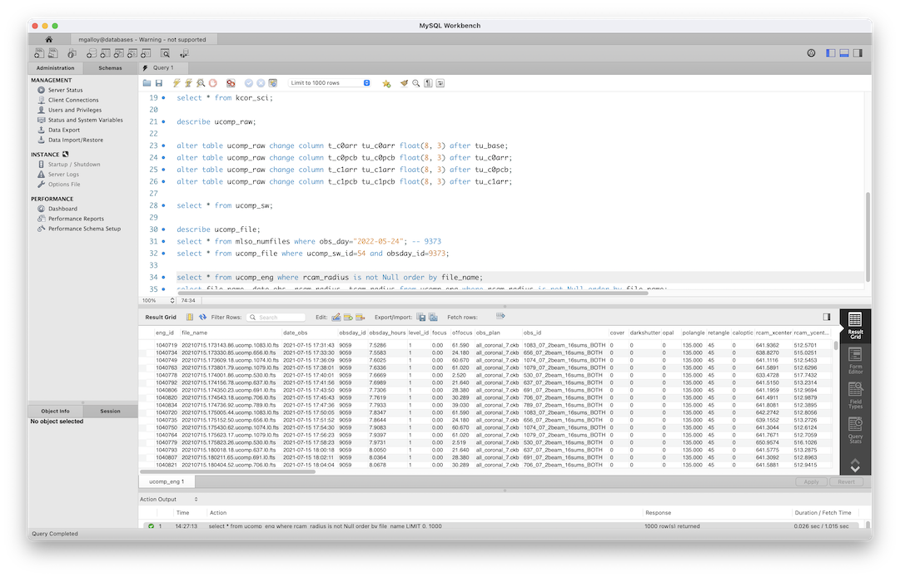

# Accessing the HAO database

Michael Galloy — mgalloy@ucar.edu

---

# Accessing the HAO database requirements

- Must be inside firewall to access HAO databases
- Get read-only login from CSMT
- Access the HAO database via the MySQL Workbench, IDL, Python, etc.

<!-- this is a presenter note -->

---

# Accessing the HAO database via MySQL Workbench

- Available for MacOS, Linux, and Windows ([download])
- Quick to test a query
- Can export to a text file for further analysis

[download]: https://www.mysql.com/products/workbench/ "MySQL :: MySQL Workbench"

---



---

# Accessing the HAO database via IDL

- Need a database credentials file with basic info about the database (make it
  read/write only for you)
- Example file, I put it in `.mysqldb`:

``` INI
[mgalloy@databases]
host     : databases.hao.ucar.edu
user     : mgalloy
password : YOUR_PASSWORD_HERE
port     : 3306
database : MLSO
```

- You can have multiple logins in a credentials file, e.g., for the webdev
  database and the production database

---

# Example IDL code, Part 1

Need `MGdbMySQL` class (`mgdbmysql__define.pro` in any of the pipeline repos's
`lib` directory)

``` IDL
db = mgdbmysql()
db->connect, config_filename='~/.mysqldb', $
             config_section='mgalloy@databases', $
             status=status, $
             error_message=error_message

; status should be 0, otherwise check error_message

obsday_id = 9473
data = db->query('select * from ucomp_file where obsday_id=%d', obsday_id,  $
                 status=status, $
                 error_message=error_message, $
                 sql_statement=sql_statement)

obj_destroy, db
```

---

# Example IDL code, Part 2

Results are in a array of structures:

``` IDL
IDL> help, data
DATA            STRUCT    = -> <Anonymous> Array[653]
IDL> help, data[0]
** Structure <1b71178>, 30 tags, length=200, data length=192, refs=2:
   FILE_ID         LONG           1472528
   DT_CREATED      STRING    '2023-12-02 16:04:16'
   FILE_NAME       STRING    '20220901.175348.ucomp.530.l1.p3.fts'
   L0_FILE_NAME    STRING    '20220901.175348.48.ucomp.530.l0.fts'
   DATE_OBS        STRING    '2022-09-01 17:53:48'
   OBSDAY_ID       LONG              9473
   OBSDAY_HOURS    FLOAT           7.89670
...
IDL> help, data.date_obs
<Expression>    STRING    = Array[653]
```

---

# Example Python code, Part 1

``` Python
>>> import mysql
>>> import mysql.connector

>>> connection = mysql.connector.connect(host="databases.hao.ucar.edu",
    user="mgalloy", password="MY_PASSWORD")
>>> cursor = connection.cursor()

>>> obsday_id = 9473
>>> q = f"select * from MLSO.ucomp_file where obsday_id={obsday_id}"
>>> cursor.execute(q)
>>> rows = cursor.fetchall()
```

---

# Example Python code, Part 2

```
>>> rows[0]
(1472528,
 datetime.datetime(2023, 12, 2, 16, 4, 16),
 '20220901.175348.ucomp.530.l1.p3.fts',
 '20220901.175348.48.ucomp.530.l0.fts',
 datetime.datetime(2022, 9, 1, 17, 53, 48),
 9473,
 7.8967,
 2261,
 2,
 28,
 1,
 'all_wavelength_coronal.cbk',
 '530_03wave_2beam_16sums_8rep_BOTH',
 0,
 16,
 0,
 0,
 0,
 0,
 11,
 32,
 11,
 33,
 139.4056,
 602.6799,
 7.0,
 121.0,
 '530',
 3,
 56)
>>> cursor.close()
>>> connection.close()
```